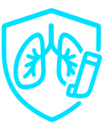

<h1 align="center">
  
  <strong>AsthmaCare</strong>
</h1>

<p align="center">
  
  
  
  
</p>

---

<p align="center">
  
</p>

<p align="center"><strong>Sistem Pendukung Keputusan untuk Deteksi Dini Penyakit Asma.</strong></p>

---

## 👥 Project Contributors – AsthmaCare

| Name               | Role                                         | GitHub Username                                  |
|--------------------|----------------------------------------------|---------------------------------------------------|
| Muhamad Aulia   | Frontend Developer & Project Owner          | [@aulia250906](https://github.com/aulia250906)   |
| Muhammad Faiq      | Backend Developer & Database Integration     | [@Mufaaaa](https://github.com/Mufaaaa)           |
| Leo Afif Eka Permana | Frontend Developer                         | [@leoafif13](https://github.com/leoafif13)       |
| Arabella Advania Ginting | UI/UX & Documentation                      | [@araanjay](https://github.com/araanjay)         |


> 📝 *Each contributor played an important role in the development of AsthmaCare.*

---

## 📦 About the Project

**AsthmaCare** adalah **Sistem Pendukung Keputusan (SPK)** berbasis web yang dirancang untuk mendeteksi dini risiko penyakit **asma** melalui beberapa pertanyaaan yang berkaitan dengan asma.

Aplikasi ini menyediakan analisis tingkat risiko (Rendah, Sedang, Tinggi) dan edukasi singkat tentang penanganan awal penyakit asma.

---

## 🌟 Key Features

- 🧠 **Deteksi Dini Asma** – Sistem menghitung tingkat risiko berdasarkan gejala.
- 📊 **Output Risiko Asma** – Hasil berupa kategori Risiko Rendah / Sedang / Tinggi.
- 👤 **Riwayat Pemeriksaan** – Menyimpan data input pengguna.
- 📚 **Informasi Edukatif** – Penjelasan gejala & tips penanganan awal.

---

## 🛠️ Tech Stack

- **Backend:** Laravel 12, MySQL  
- **Frontend:** TailwindCSS, Blade  
- **Full-stack Tooling:** Livewire  
- **Admin Panel:** Filament  
- **Dependency Tools:** npm, Composer  

---

## 🚀 Getting Started

### **Prerequisites**
- PHP 8.3+
- Composer
- Node.js & NPM
- MySQL

---

### 💻 Installation (Step-by-Step)

1. **Clone the repository and navigate to the project directory**
    ```bash
    git clone https://github.com/aulia250906/AsthmaCare.git
   cd AsthmaCare
    ```

2. **Install backend and frontend dependencies**
    ```bash
    composer install
    npm install
    ```

3. **Copy and configure the environment file**
    ```bash
    cp .env.example .env
    # Edit the .env file:
    # - DB_DATABASE=your_database
    # - DB_USERNAME=your_username
    # - DB_PASSWORD=your_password
    ```

4. **Generate application key and migrate the database**
    ```bash
    php artisan key:generate
    php artisan migrate --seed
    ```

5. **Build frontend assets and run the development server**
    ```bash
    npm run dev
    php artisan serve
    ```

🔗 Access the application via your browser: [http://127.0.0.1:8000](http://127.0.0.1:8000)

---
